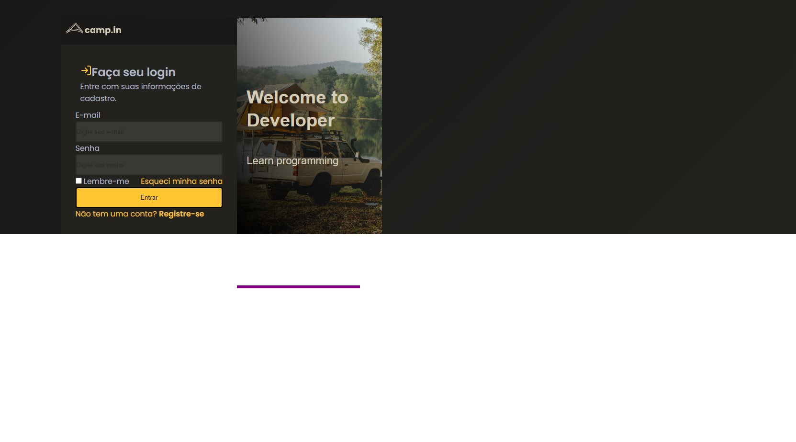
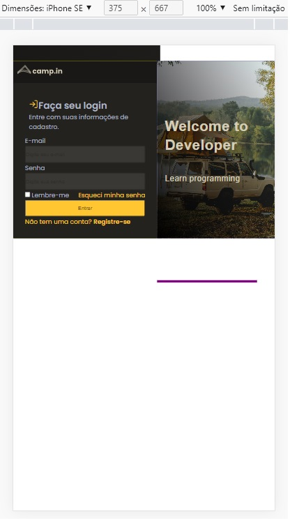

<h4 align="center"> 
	🚧 Login Form 🚀
</h4>

<p align="center" style="display: flex; align-items: flex-start; justify-content: center;">
  
</p>  

### 💻 Sobre o desafio

O desafio desse projeto é criar um formulário de login.

#### 💻 Techs

- Nível de dificuldade: Intermediário
- Tecnologias: html, css

#### 💻 Como começar?

1 - Use o link do [Figma](https://www.figma.com/file/pxHVsTJwZVFZ9UEqJC0GJR/DD-Login-Form-CSS-Copy?fuid=850142401757702475) como base para o projeto. Também disponibilizamos para download todos os assets necessários (imagens e ícones), para fazer o download basta clicar no link acima.  

2 - Leia com atenção todas as instruções do desafio.

3 - Bora codar! Lembre-se que você pode usar as tecnologias que se sentir mais confortável, mas também pode se desafiar usando novas techs, fazendo modificações e/ou adicionando funcionalidades no projeto como preferir. 🚀

4 - Compartilhe seu resultado ou tire suas dúvidas na nossa [**comunidade aberta**](https://discord.gg/bacwY2gDCF)

### 💡 Conteúdos Aplicados

- [x] 💡[O guia estelar de HTML](https://app.rocketseat.com.br/node/o-guia-estelar-de-html)
- [x] 💡[O guia estelar de CSS](https://app.rocketseat.com.br/node/o-guia-estelar-de-css)
- [x] 💡[Posicionando foguetes](https://app.rocketseat.com.br/node/posicionando-foguetes)
- [ ] 💡[Formulários de outro planeta](https://app.rocketseat.com.br/node/formularios-de-outro-planeta)
- [x] 💡[Alinhando os planetas](https://app.rocketseat.com.br/node/flexbox)
- [ ] 💡[App bonito, até nos textos](https://app.rocketseat.com.br/node/flexbox)
- [ ] 💡[:focus-within](https://developer.mozilla.org/pt-BR/docs/Web/CSS/:focus-within)

### 🚀 [Requisitos do projeto no notion](https://efficient-sloth-d85.notion.site/Desafio-Login-Form-CSS-a10caea5a183494e97eb9ce4f33536b3)

- [ ] atender ao layout do Figma
- [x] estrutura do html: trabalhando nas divs
- [x] responsividade com grid ou flexbox das divs
- [ ] Os inputs devem ter estilos diferentes dependendo do estado (normal ou em foco)
    - Normal
        
        
        
    - Em foco
        
        
        
    - Checkbox
        
        
        
- [ ] ser um design responsivo com o layout do Figma
 
### 🎨 Style Guide

#### 🎨 Cores

- [ ] inserir as variáveis de cores

````css
:root {
  --text-base: #afb6c2;
  --text-title: #d4ccb6;
  --background: #191816;
  --form-background: #24221f;
  --primary-color: #ffc632;
}
````

#### 🎨 Fontes

- [x] inserir as variáveis de [Google Fonts](https://fonts.google.com/)
- font-family: Poppins. font Weight: 400, 500 e 600
- font-family: Roboto. Font Weight: 400 e 500 

#### 🎨 Templates de referências para ser feito

<p align="center" style="display: flex; align-items: flex-start; justify-content: center;">
  
  
</p>  

### 📅 Entrega

Após concluí-los, adicionar esses códigos ao seu Github é uma boa forma de demonstrar seus conhecimentos para oportunidades futuras.

#### 📅 Gestão do projeto

- [x] Organizando os detalhes do projeto no readme.md
- [x] Uma branch main e uma developer, uma branch para cada tarefa
- [x] Favicon
- [ ] [Learn Responsive Design](https://web.dev/learn/design/)
- [ ] [Learn CSS](https://web.dev/learn/css/)

#### 📅 Telas Finais

- Desktop

<p align="center" style="display: flex; align-items: flex-start; justify-content: center;">
  
</p>  

- Mobile

<p align="center" style="display: flex; align-items: flex-start; justify-content: center;">
  
</p>  

Feito com ❤️ por Douglas A B Novato. 👋🏽 [Entre em contato!](https://www.linkedin.com/in/douglasabnovato/)
 
Fonte do projeto na [Rocketseat](https://www.rocketseat.com.br/). 👋 Participe da [comunidade aberta](https://discord.gg/bacwY2gDCF)!